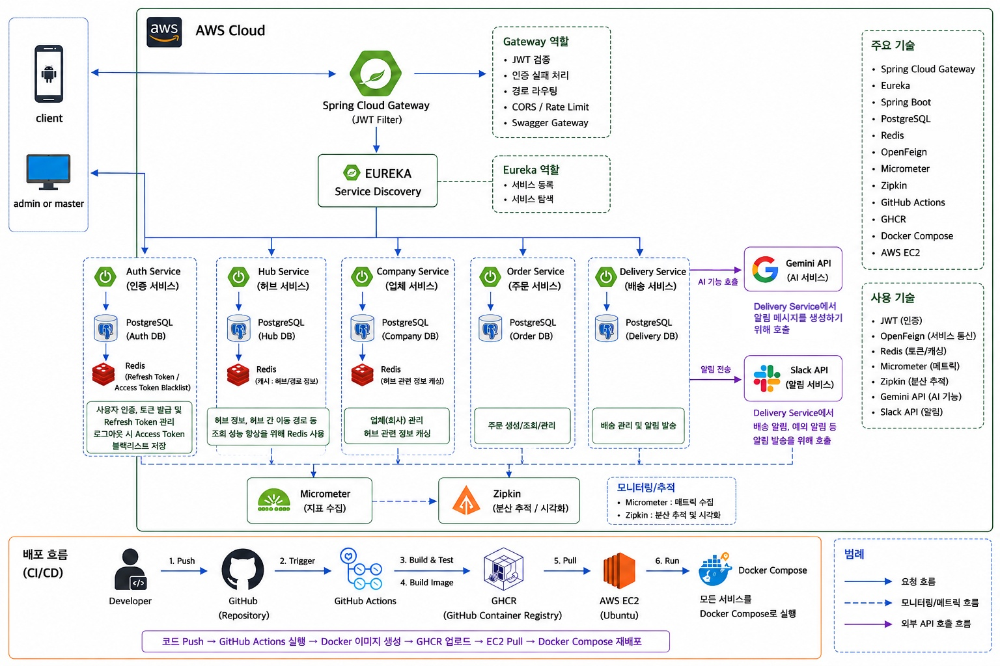

# 🚚 물류 관리 및 배송 시스템

Spring Cloud MSA 기반 물류 관리 플랫폼

      

## 📌 Project Overview

### 🎯 프로젝트 목적

허브 간 물류 이동과 업체 주문을 하나의 플랫폼에서 처리하는 **B2B 물류 관리 시스템**을 개발합니다. 주문 접수부터 재고 차감, 배송 경로 생성, 담당자 배정, 슬랙 알림까지의 전 과정을 자동화하고, 이를 **마이크로서비스 아키텍처(MSA)** 로 구현하여 서비스별 독립 배포와 장애 격리가 가능한 구조를 만드는 것을 목표로 합니다.

### 📝 프로젝트 상세

- Spring Cloud 기반 **MSA 아키텍처**를 적용하여 8개의 독립 서비스로 물류 플랫폼을 구현했습니다.
- **Eureka** 서비스 디스커버리와 **Spring Cloud Gateway**를 통해 서비스 등록·라우팅·인증을 일원화했습니다.
- **Database per Service** 원칙에 따라 각 서비스가 독립된 DB를 사용하며, 서비스 간 통신은 **OpenFeign**으로 처리합니다.
- 주문 생성 시 재고 차감 → 배송 생성 → 경로 산출 → AI 발송 시한 계산 → 슬랙 발송으로 이어지는 흐름을 구현하고, 중간 실패 시 **보상 트랜잭션**으로 재고와 배송을 되돌립니다.
- **Spring AI + Google Gemini**로 배송 발송 시한을 자동 산출하고, 결과를 슬랙으로 발송합니다.
- **Redis 캐싱**, **QueryDSL 동적 검색**, **Zipkin 분산 추적**, **Flyway 마이그레이션**을 적용했습니다.
- **Docker Compose + AWS EC2 + GitHub Actions(GHCR)** 기반 컨테이너 배포 및 CI/CD 환경을 구축했습니다.

### 📋 프로젝트 정보

- **프로젝트 기간** : 2026.07.30 ~ 2026.08.13
- **개발 인원** : 5명
- **아키텍처** : Spring Cloud MSA (8 Services)
- **배포 환경** : AWS EC2 + Docker Compose + GitHub Actions

## ✨ 주요 기능

| 👤 사용자(User) | 🏢 허브(Hub) | 🏪 업체 · 상품 |
|:---:|:---:|:---:|
| ✅ 회원가입 / 로그인<br>✅ JWT 발급 및 재발급<br>✅ 로그아웃 (토큰 블랙리스트)<br>✅ 가입 승인 / 반려<br>✅ 회원 목록 조회 / 탈퇴 | ✅ 허브 CRUD<br>✅ 허브 간 이동정보 CRUD<br>✅ 출발·도착 경로 탐색<br>✅ 허브 비활성화 / 최종 삭제<br>✅ Redis 캐싱 적용 | ✅ 업체 CRUD / 검색<br>✅ 상품 CRUD / 검색<br>✅ 재고 차감 (멱등성 보장)<br>✅ 재고 복원 (보상 트랜잭션)<br>✅ Redis 캐싱 적용 |

| 📦 주문(Order) | 🚚 배송(Delivery) | 👷 배송 담당자 | 🤖 AI · 슬랙 |
|:---:|:---:|:---:|:---:|
| ✅ 주문 생성 (재고·배송 연동)<br>✅ 주문 조회 / 검색<br>✅ 주문 수정 / 상태 변경<br>✅ 주문 취소 (보상 트랜잭션)<br>✅ 주문 삭제 | ✅ 배송 생성 / 조회 / 검색<br>✅ 배송 수정 / 취소 / 삭제<br>✅ 배송 경로 자동 생성<br>✅ 경로별 상태 관리<br>✅ 권한별 조회 범위 제한 | ✅ 담당자 등록 / 조회<br>✅ 담당자 목록 검색<br>✅ 담당자 수정 / 삭제<br>✅ 순번 기반 자동 배정<br>✅ 허브 / 업체 타입 구분 | ✅ AI 발송 시한 산출<br>✅ AI 메시지 이력 관리<br>✅ AI 재생성 (재시도)<br>✅ 슬랙 메시지 발송 / 재발송<br>✅ 발송 이력 조회 |

## 👨‍💻 Team Members

| 이름  | GitHub | 담당 |
|:---:|:------:|------|
| 이규민 | [@aa04260](https://github.com/aa04260) | 회원(User), 게이트웨이, 인프라 / 배포 |
| 한승욱 | [@hanwoo7726](https://github.com/hanwoo7726) | 허브(Hub), 허브 간 이동정보 |
| 백승환 | [@Hwan100](https://github.com/Hwan100) | 업체(Company), 상품(Product) |
| 박수연 | [@blue-park-programmer](https://github.com/blue-park-programmer) | 주문(Order) |
| 김준서 | [@joonseo21](https://github.com/joonseo21) | 배송(Delivery), 배송 담당자, AI · 슬랙 |


## 🛠 Tech Stack

### Backend

       

### MSA

   

### Database

  

### Infra

    

### Collaboration

   

## 🏗️ Service Architecture



모든 외부 요청은 **Gateway**를 단일 진입점으로 통과하며, 각 서비스는 **Eureka**에 등록되어 서비스명으로 서로를 찾습니다.<br><br>

✔️ **Gateway** — JWT 검증 후 `X-User-Id` / `X-Username` / `X-User-Role` 헤더로 사용자 정보를 다운스트림에 전파<br>
✔️ **Eureka** — 서비스 디스커버리, `lb://service-name` 기반 로드밸런싱<br>
✔️ **OpenFeign** — 서비스 간 REST 통신, `X-Internal-Call` 헤더로 내부 호출 식별<br>
✔️ **Database per Service** — 서비스별 독립 DB, 직접 조회 금지<br>
✔️ **Zipkin** — 서비스를 넘나드는 요청의 분산 추적<br>
✔️ **GitHub Actions → GHCR → EC2** — main 브랜치 머지 시 이미지 빌드 후 자동 배포

### 마이크로서비스 구성

| 서비스 | 포트 | 설명 |
|--------|:----:|------|
| `eureka-service` | 8761 | 서비스 디스커버리 |
| `gateway-service` | 8080 | 라우팅, JWT 인증/인가, Swagger 통합 |
| `user-service` | 19091 | 사용자 관리, JWT 발급, 토큰 블랙리스트(Redis) |
| `hub-service` | 19092 | 허브 관리, 허브 간 이동정보, 경로 탐색(Redis 캐싱) |
| `company-service` | 19093 | 업체·상품 관리, 재고 차감/복원(Redis 캐싱) |
| `order-service` | 19094 | 주문 관리, 재고·배송 연동, 보상 트랜잭션 |
| `delivery-service` | 19095 | 배송·배송 경로·배송 담당자 관리 |
| `slack-service` | 19096 | AI 발송 시한 산출(Gemini), 슬랙 메시지 발송 |
| `common` | – | 공통 라이브러리 모듈 (응답 포맷, 예외, BaseEntity, 인증 헤더) |

### 주문 처리 흐름

```
주문 생성 요청
  → [order] 사용자·업체·상품 검증
  → [company] 재고 차감 (멱등성 키 기반)
  → [delivery] 배송 생성 + 허브 경로 산출 + 담당자 자동 배정
  → [slack] AI 발송 시한 산출 → 슬랙 발송
  → 주문 확정

  ✗ 중간 실패 시 → 배송 취소 + 재고 복원 (보상 트랜잭션)
```

## 💡 주요 설계 포인트

| 구분 | 내용 |
|------|------|
| **인증/인가** | Gateway가 JWT를 단독 검증하고 결과를 헤더로 전파. 각 서비스는 `@PreAuthorize`로 역할 기반 인가만 수행 |
| **내부 호출 구분** | Feign 호출에 `X-Internal-Call` 헤더를 부착해 사용자 요청과 서비스 간 호출을 분리 |
| **데이터 일관성** | 분산 트랜잭션 대신 **보상 트랜잭션** 적용. 재고 차감/복원은 멱등성 키로 중복 호출을 방지 |
| **장애 격리** | 외부 연동에 타임아웃 필수 적용 (Gemini 30초 / 슬랙 연결 3초·응답 10초) — 스레드 점유로 인한 장애 전파 차단 |
| **재시도 전략** | 일시 오류(429·5xx·타임아웃)만 지수 백오프로 최대 3회 재시도. 인증·요청 오류는 즉시 실패시켜 무의미한 재시도 제거 |
| **동적 검색** | 문자열 JPQL의 동적 조건 한계(빈 `IN` 절, 타입 추론 실패)를 **QueryDSL**로 해결 |
| **캐싱** | 허브 경로·업체·상품 등 조회 비중이 높은 데이터에 서비스별 독립 Redis 적용 |
| **공통 규약** | 전 엔티티 UUID PK, Audit 필드, **Soft Delete** 를 `BaseEntity`로 통일 |

## 🗄 ERD

🔗 [ERD Cloud](https://www.erdcloud.com/d/e3J4iueT4yCLhPdym)

## 📄 API Documentation

Gateway를 통해 전체 서비스의 Swagger 문서를 통합 조회할 수 있습니다.
localhost로 된 부분은 개발 진행환경의 도메인으로 변경하시면 됩니다.

```
http://3.34.126.231:8080/swagger-ui.html
```

## 🚀 Quick Start

### 1. Clone Repository

```bash
git clone https://github.com/Team0404/backend.git
cd backend
```

### 2. Environment Variables

`.env.example`을 복사해 `.env`를 만들고 값을 채웁니다. `.env`는 git에 커밋되지 않습니다.
localhost로 된 부분은 개발 진행환경의 도메인으로 변경하시면 됩니다.
```bash
cp .env.example .env
```

```env
# --- Database (PostgreSQL) ---
DB_HOST=localhost
DB_PORT=5432
DB_USERNAME=postgres
DB_PASSWORD=
DDL_AUTO=validate
SHOW_SQL=true

# --- Redis (서비스별 캐시) ---
HUB_REDIS_HOST=localhost
HUB_REDIS_PORT=6379
COMPANY_REDIS_HOST=localhost
COMPANY_REDIS_PORT=6381
USER_REDIS_HOST=localhost
USER_REDIS_PORT=6380

# --- Eureka / Zipkin ---
EUREKA_URL=http://localhost:8761/eureka/
ZIPKIN_URL=http://localhost:9411/api/v2/spans

# --- JWT (user-service 발급 / gateway 검증) ---
JWT_SECRET=
JWT_ACCESS_EXPIRATION=900000

# --- AI (slack-service, Gemini Developer API) ---
GEMINI_API_KEY=
GEMINI_MODEL=gemini-flash-latest

# --- Slack (slack-service) ---
SLACK_BOT_TOKEN=
SLACK_WEBHOOK_URL=
```

### 3. Run Infrastructure

PostgreSQL, Redis(3종), Zipkin을 컨테이너로 실행합니다. 최초 기동 시 서비스별 DB가 자동 생성됩니다.

```bash
docker compose up -d
```

### 4. Run Services

인프라가 뜬 상태에서 각 서비스를 실행합니다. **Eureka → Gateway → 나머지** 순서를 지켜주세요.

```bash
./gradlew :eureka-service:bootRun
./gradlew :gateway-service:bootRun
./gradlew :user-service:bootRun
./gradlew :hub-service:bootRun
./gradlew :company-service:bootRun
./gradlew :order-service:bootRun
./gradlew :delivery-service:bootRun
./gradlew :slack-service:bootRun
```

전체를 컨테이너로 실행하려면:

```bash
docker compose --profile apps up -d --build
```

### 5. Access

**로컬 실행 환경**

| 대상 | 주소 |
|------|------|
| API Gateway | http://localhost:8080 |
| Swagger UI | http://localhost:8080/swagger-ui.html |
| Eureka Dashboard | http://localhost:8761 |
| Zipkin | http://localhost:9411 |

**배포 서버 (AWS EC2)**

| 대상 | 주소 |
|------|------|
| API Gateway | http://3.34.126.231:8080 |
| Swagger UI | http://3.34.126.231:8080/swagger-ui.html |
| Eureka Dashboard | http://3.34.126.231:8761 |
| Zipkin | http://3.34.126.231:9411 |

### 6. Stop

```bash
docker compose down       # 종료 (데이터 유지)
docker compose down -v    # 데이터 볼륨까지 삭제
```

## 📖 Documentation

- [CONTRIBUTING.md](CONTRIBUTING.md) — 코드 컨벤션, 브랜치 전략, PR 정책
- [Flyway 마이그레이션 가이드](docs/flyway-migration-guide.md)
